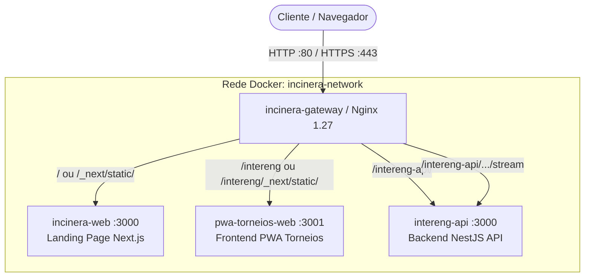

# Incinera Gateway (Nginx Reverse Proxy)

Gateway reverso centralizado e de alta performance para todo o ecossistema de aplicações e microsserviços da **Atlética Incinera** hospedados na infraestrutura de VM do CIn/UFPE.

---

## 🏛️ Visão Geral e Arquitetura

O `incinera-gateway` atua como o único ponto de entrada público HTTP/HTTPS (Portas 80 e 443) na VM. Ele roteia o tráfego dinamicamente para os containers individuais conectados à rede Docker compartilhada isolada (`incinera-network`).



---

## 🗺️ Tabela de Roteamento Global

| Caminho Externo | Modificador | Upstream / Destino | Cache / Otimização | Descrição |
| :--- | :--- | :--- | :--- | :--- |
| `/healthz` | `=` (Exato) | Resposta direta 200 OK | `access_log off` | Healthcheck de monitoramento do gateway |
| `/intereng-api/.../stream` | `~*` (Regex Aninhado) | `http://intereng_api_upstream` | `buffering off`, timeout 24h | SSE / Tempo real de partidas (NestJS) |
| `/intereng-api/` | `^~` (Prefix Prioritário) | `http://intereng_api_upstream` | Standard proxy headers | Backend NestJS (com rewrite de rota) |
| `/intereng/_next/static/` | `^~` (Prefix Prioritário) | `http://intereng_web_upstream` | `max-age=31536000, immutable` | Assets estáticos com hash do PWA |
| `/intereng` | `^~` (Prefix Prioritário) | `http://intereng_web_upstream` | Standard proxy headers | Frontend PWA Torneios (Next.js) |
| `/_next/static/` | `^~` (Prefix Prioritário) | `http://incinera_landing_upstream` | `max-age=31536000, immutable` | Assets estáticos com hash da Landing Page |
| `~* \.(png\|jpg\|svg\|...)` | `~*` (Regex) | `http://incinera_landing_upstream` | `max-age=2592000` (30 dias) | Mídias públicas da Landing Page |
| `/` | Padrão (Fallback) | `http://incinera_landing_upstream` | Standard proxy headers | Landing Page Principal da Atlética |

### 💡 Por que usamos o modificador `^~`?
No algoritmo de resolução de locais do Nginx, regras com Expressões Regulares (`~` ou `~*`) têm precedência sobre regras de prefixo normais.
Sem o modificador `^~`, uma requisição para `/intereng/logo.png` seria interceptada pela regex de imagens da Landing Page e direcionada para a porta errada. O modificador `^~` instrui o Nginx a **interromper a checagem de regexes** se o prefixo mais específico coincidir.

---

## 📂 Estrutura do Repositório

```text
incinera-gateway/
├── .github/
│   └── workflows/
│       └── cd.yml                  # Pipeline CD GitHub Actions (self-hosted runner)
├── docker-compose.yml              # Definição do container Nginx e limites de recursos
├── nginx/
│   ├── nginx.conf                  # Configuração core (worker, gzip, logs, mime-types)
│   ├── conf.d/
│   │   ├── incinera.conf           # Servidor virtual principal e regras de roteamento
│   │   └── upstreams.conf          # Declaração dos backends e keepalive
│   └── includes/
│       ├── proxy-params.conf       # Headers HTTP padrão (Host, X-Real-IP, etc.)
│       ├── security-headers.conf   # Headers de segurança (X-Frame-Options, XSS, etc.)
│       └── sse-proxy-params.conf   # Headers e timeouts para Server-Sent Events
└── scripts/
    ├── init-vm.sh                  # Bootstrap inicial (criação da incinera-network)
    └── validate-config.sh          # Validador de sintaxe Nginx via Docker
```

---

## 🚀 Como Plugar um Novo Microsserviço no Gateway

Para adicionar um novo projeto (ex: `loja-incinera` na porta `3002`):

### 1. Conectar o novo container à rede externa
No `docker-compose.yml` do seu novo projeto:
```yaml
services:
  loja-web:
    image: atletica-incinera/loja:latest
    container_name: loja-incinera-web
    networks:
      - incinera-network

networks:
  incinera-network:
    external: true
```

### 2. Registrar o Upstream no Gateway
Edite `nginx/conf.d/upstreams.conf`:
```nginx
# Upstream: Loja Oficial
upstream loja_web_upstream {
    server loja-incinera-web:3002;
    keepalive 32;
}
```

### 3. Criar a Regra de Roteamento
Edite `nginx/conf.d/incinera.conf`:
```nginx
    # Assets estáticos da Loja
    location ^~ /loja/_next/static/ {
        include /etc/nginx/includes/proxy-params.conf;
        proxy_pass http://loja_web_upstream;
        expires 1y;
        access_log off;
        add_header Cache-Control "public, max-age=31536000, immutable";
    }

    # Rota da Loja
    location ^~ /loja {
        include /etc/nginx/includes/proxy-params.conf;
        proxy_pass http://loja_web_upstream;
    }
```

### 4. Validar e Recarregar
```bash
./scripts/validate-config.sh
docker exec incinera-gateway nginx -s reload
```

---

## 🔄 CI/CD Automatizado

O deploy do gateway é 100% automatizado via **GitHub Actions** (`.github/workflows/cd.yml`) executando no runner `self-hosted` da VM do CIn:
1. Disparado a cada `push` na branch `main` ou via `workflow_dispatch`.
2. Garante a existência da rede Docker `incinera-network`.
3. Valida a sintaxe dos arquivos de configuração (`nginx -t`).
4. Aplica as mudanças com **Zero-Downtime** usando `docker exec incinera-gateway nginx -s reload`.

---

## 🛠️ Comandos de Diagnóstico e Troubleshooting

### Verificar status do Gateway:
```bash
docker compose ps
curl -I http://localhost/healthz
```

### Testar resolução de DNS interno e conectividade da rede:
```bash
# Inspecionar containers conectados na rede
docker network inspect incinera-network

# Testar conectividade a partir do gateway
docker exec -it incinera-gateway ping incinera-web
docker exec -it incinera-gateway ping pwa-torneios-web
docker exec -it incinera-gateway ping intereng-api
```

### Monitorar Logs de Acesso e Erros em Tempo Real:
```bash
# Logs do Nginx Gateway
docker logs -f incinera-gateway

# Logs com filtro de erro
docker logs incinera-gateway 2>&1 | grep -i "error"
```

### Recarregar Nginx sem reiniciar o container:
```bash
docker exec incinera-gateway nginx -t && docker exec incinera-gateway nginx -s reload
```
